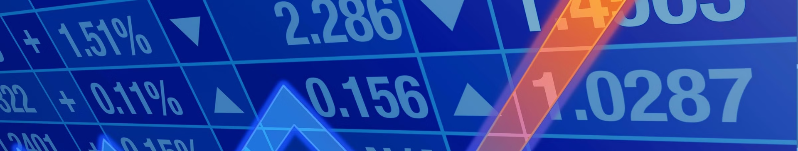
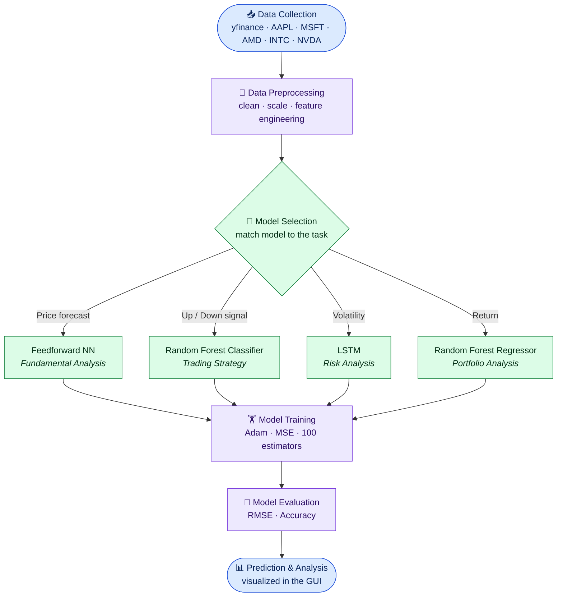
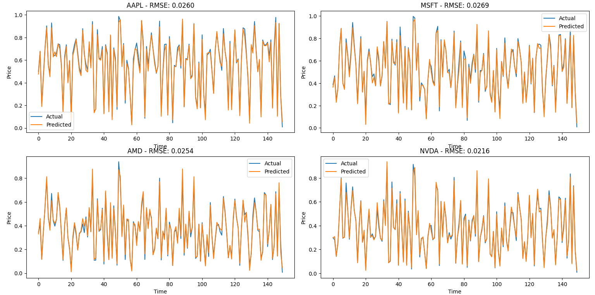
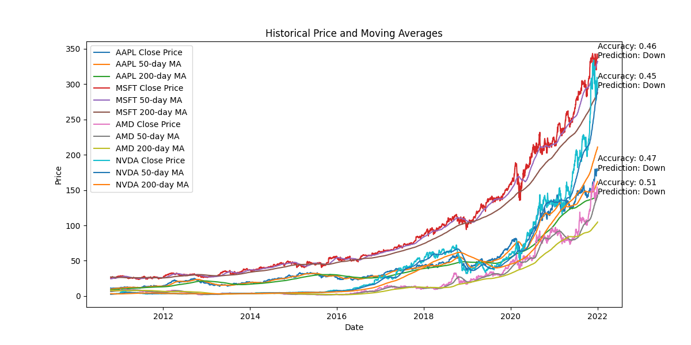
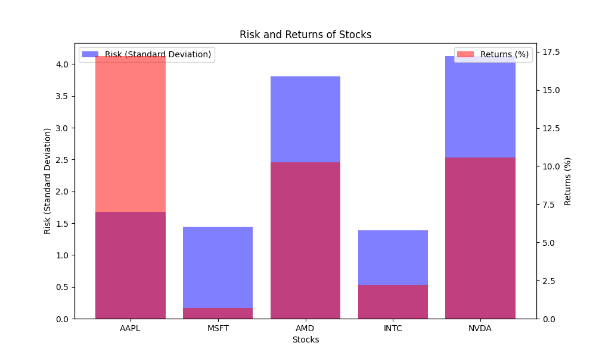
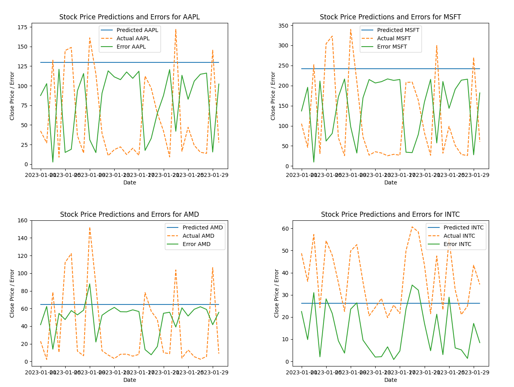

# 📈 Forecasting Stock Market Trends

### A Beginner's Guide to Predictive Modeling and Analysis



<p align="center">
  
  
  
  
  
  
</p>

An end-to-end project that pulls historical market data, trains four machine-learning models, and packages them behind a desktop GUI so a user can run **Fundamental, Trading, Risk, and Portfolio** analysis on major tech stocks from a single app.

---

## 📋 Table of Contents

- [Executive Summary](#-executive-summary)
- [Business Problem](#-business-problem)
- [Methodology](#-methodology)
- [Skills & Tech Stack](#-skills--tech-stack)
- [Results & Business Recommendations](#-results--business-recommendations)
- [Next Steps](#-next-steps)
- [How to Run](#-how-to-run)

---

## 🚀 Executive Summary

A single desktop application (Python + Tkinter) that wraps four predictive models, each mapped to a real investing question:

| Analysis | Model | Question it answers |
| --- | --- | --- |
| **Fundamental Analysis** | Feedforward Neural Network | Where is the price likely heading next? |
| **Trading Strategy** | Random Forest Classifier | Should I expect the price to move up or down? |
| **Risk Analysis** | Long Short-Term Memory (LSTM) | How volatile is this stock over time? |
| **Portfolio Analysis** | Random Forest Regressor | What return/risk trade-off does each holding offer? |

Data is sourced live through the **yfinance** API for five large-cap tech names — **AAPL, MSFT, AMD, INTC, NVDA** — so every analysis runs on real, up-to-date market history.

---

## 🧩 Business Problem

Stock prices are noisy, non-stationary, and emotionally charged — which makes consistent, data-driven decision-making hard for individual investors. Three pain points motivated this project:

1. **Direction is hard to call.** Day-to-day price movement looks close to random, so eyeballing a chart rarely beats guessing.
2. **Risk is invisible until it hurts.** Investors often chase returns without a clear, comparable view of how much volatility they are taking on.
3. **The tooling is fragmented.** Useful techniques live in separate notebooks and libraries, out of reach for anyone who isn't comfortable with code.

---

## 🛠 Methodology
The diagram below is rendered live by GitHub (Mermaid). It traces a single ticker from raw data, through model selection into the four analyses, and back to a unified evaluation and visualization step.


<details>
<summary><b>📂 Expand each pipeline step</b></summary>

<br/>

- **📥 Data Collection** — `yfinance` pulls historical OHLCV data for the five tickers.
- **🧹 Data Preprocessing** — clean missing values, `MinMaxScaler` for sequence models, engineer features (50/200-day moving averages, lagged windows, next-day targets), then `train_test_split`.
- **🧠 Model Selection** — route the task to the right model: price → FNN, direction → RF Classifier, volatility/sequence → LSTM, return → RF Regressor.
- **🏋️ Model Training** — Keras `Sequential` networks (Adam optimizer, MSE loss) and scikit-learn ensembles (`n_estimators=100`).
- **📏 Model Evaluation** — RMSE for regression tasks, accuracy for the directional classifier.
- **📊 Prediction & Analysis** — results are charted and shown back to the user inside the GUI.

</details>

---

## 💡 Skills & Tech Stack

**Machine Learning & Deep Learning**

- Feedforward Neural Networks & LSTM (TensorFlow / Keras)
- Random Forest Classifier & Regressor (scikit-learn)
- Time-series feature engineering, train/test splitting, model evaluation (RMSE, accuracy)

**Data & Tooling**

- Python · `yfinance` · `pandas` · `numpy`
- `matplotlib` for visualization
- `scikit-learn` preprocessing (`MinMaxScaler`, `train_test_split`)

**Application & Delivery**

- `Tkinter` desktop GUI (tabbed, four analyses)
- Reproducible Jupyter/Colab notebooks per analysis

**Domain & Soft Skills**

- Financial concepts: moving averages, volatility, risk/return, directional trading
- Responsible-AI awareness (bias, transparency, accountability)

---

## 📊 Results & Business Recommendations

### Fundamental Analysis — Feedforward Neural Network

The FNN tracks the actual (normalized) price closely across all five stocks, with small prediction error — confirming the network learns the broad price trajectory.



**Recommendation:** use the FNN as a trend-tracking aid, not a precise price oracle — it captures direction of movement better than exact levels.

### Trading Strategy — Random Forest Classifier

Using the 50-day and 200-day moving averages as features, the classifier flags whether the next move is up or down. On historical data its directional accuracy sits around the coin-flip line, a candid reminder of how efficient these markets are.



**Recommendation:** treat directional signals as one input among many. Always pair with a moving-average trend filter rather than trading the signal alone.

### Risk Analysis — Volatility & Returns

Plotting each stock's risk (standard deviation) against its returns gives an at-a-glance risk/return map. Higher-growth names (e.g., NVDA, AMD) carry visibly more volatility than steadier names like MSFT and INTC.



**Recommendation:** size positions to volatility — demand higher expected return from the higher-risk names, and lean on lower-volatility names for stability.

### Portfolio Analysis — Random Forest Regressor

Per-stock prediction-vs-error charts show where the regressor is confident and where it drifts, helping weight holdings by predictability as well as return.



**Recommendation:** favor holdings the model predicts more reliably, and diversify across the risk spectrum rather than concentrating in the highest-return name.

> ⚠️ **Disclaimer:** This is an educational project, not financial advice. The models are trained on historical data and can be wrong. Do your own research before making investment decisions.

---

## 🔭 Next Steps

- **Explore advanced techniques** — test transformer-based and hybrid time-series models.
- **Integrate alternative data** — news sentiment, earnings, and macro signals to enrich features.
- **Embrace explainable AI** — attach feature importance / SHAP explanations to every prediction.
- **Research market psychology** — fold behavioral-finance signals into the feature set.
- **Productionize** — add backtesting, automated retraining, and a broader universe of tickers.

---

## ▶️ How to Run

```bash
# 1. Clone the repository
git clone https://github.com/<your-username>/stock-market-forecasting.git
cd stock-market-forecasting

# 2. (Recommended) create a virtual environment
python -m venv venv
source venv/bin/activate        # Windows: venv\Scripts\activate

# 3. Install dependencies
pip install yfinance pandas numpy scikit-learn tensorflow matplotlib

# 4. Launch the app
python stock_analysis_app.py
```

Then pick a tab — **Fundamental Analysis**, **Trading Strategy**, **Risk Analysis**, or **Portfolio Analysis** — and click **Run Analysis**.

---

## ⚖️ Ethics & Responsible Use

This project takes a deliberate stance on responsible AI: predictions can carry bias and should never replace human judgment. Outputs are meant to *inform* decisions with transparency and accountability — not to automate trades or guarantee returns.

---

<p align="center"><em>Built as an educational deep-dive into predictive modeling for the stock market.</em></p>
